# 环境搭建
## 工具软件的下载与安装

前置准备工作:
1. Git工具
2. ENV工具
3. OpenOCD工具
4. RT-Thread源码
5. VSCode(这个需要自己先安装好)
6. github加速器(需自备)

>我这里统一把东西都下载到d盘下的rtthread文件夹下
### Git工具安装

来到git的官网[Git - Downloading Package](https://git-scm.com/download/win)
根据电脑版本任选其一，下载安装


安装完成后可以查看下自己电脑有没有这两个软件
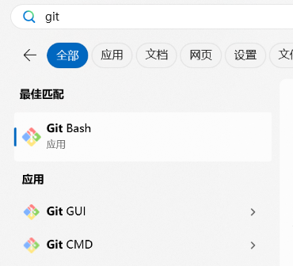

有就是安装好了,可以打开着备用

## ENV工具
打开下载链接
[https://download-redirect.rt-thread.org/download/env_release/env-windows-v2.0.0.7z](https://download-redirect.rt-thread.org/download/env_release/env-windows-v2.0.0.7z)
下载解压到rtthread文件夹
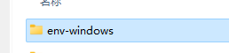
进入该目录，双击打开 env.exe文件 ，他就会自动开始下载配置env环境(网络不好的也许要挂加速器？)，等一段时间，命令行不动了，按下回车看下会不会弹出一段路径，有的话就是配置好了
### 然后是注册到环境变量里
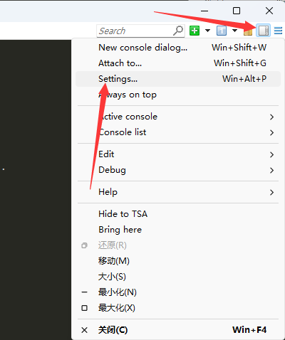
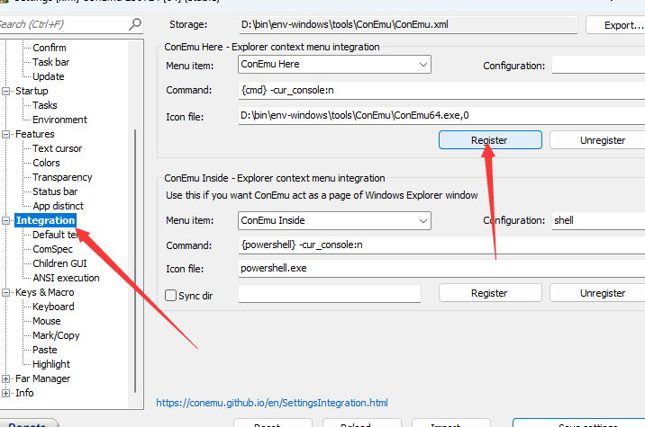

## RT-Thread源码下载

打开刚才装好的git bash输入cd /d/rtthread/按下回车
来到rtthread文件夹下

接下来依次输入每一行并回车

```
git clone https://github.com/RT-Thread/rt-thread.git
```

```
cd rt-thread
```

```
git checkout RSOC-2024
```

这些命令的作用是下载RTThread源码并切换到相应的分支

接下来打开文件夹
来到这个目录下
```
D:\rtthread\rt-thread\bsp\stm32\stm32f407-rt-spark
```
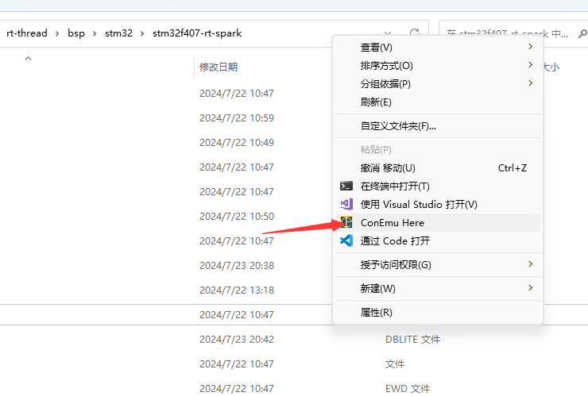

右键空白处会出现刚才我们安装的ENV窗口
打开之后输入scons --target=vsc生成VSCode工程文件
紧接着输入code .
回车即可从当前文件夹打开vscode

## 安装vscode插件

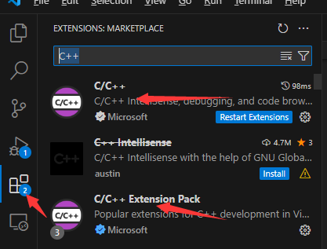

来到左边点击拓展，搜索c++就会弹出这两个拓展，点击安装
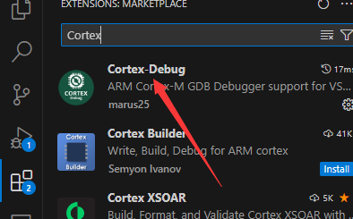

这个也要装上，一样的步骤

随后开始配置vscode调试配置

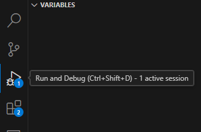

在左边找到调试按钮，点进去，可以看到有个创建launch.json文件，点击

界面上会出现一个类似搜索框的东西
搜索框下面有个Cortex Debug，点击即可

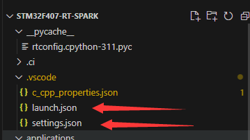
找到launch.json打开
另外settings.json可以右键自己新建好等会用

这里直接用官方教程的配置替换掉原来的,并改下GCC工具链路径
```
{

"version": "0.2.0",

"configurations": [

{

"name": "rt-spark-openocd",

"executable": "${workspaceRoot}/rt-thread.elf",

"request": "launch",

"type": "cortex-debug",

"runToEntryPoint": "main",

"targetId": "STM32F407ZG",

"servertype": "openocd",

"configFiles": [

"interface/stlink-v2.cfg",

"target/stm32f4x.cfg"

],

"armToolchainPath": "D:/workspace_work/env-windows/tools/gnu_gcc/arm_gcc/mingw/bin", // ！！！需要修改为自己的GCC 工具链路径 ！！！

"gdbPath": "D:/workspace_work/env-windows/tools/gnu_gcc/arm_gcc/mingw/bin/arm-none-eabi-gdb.exe" // ！！！需要修改为自己的GDB 路径 ！！！

}

]

}
```

来到settings.json，没有就新建一个

下载[Download OpenOCD for Windows](https://gnutoolchains.com/arm-eabi/openocd/)
OpenOCD放到rtthread文件夹下

然后settings.json用下面配置替代
```
{

    "files.associations": {

        "*.txt": "dockercompose",

        "board.h": "c",

        "rtdevice.h": "c",

        "drv_gpio.h": "c",

        "rtthread.h": "c",

        "drv_matrix_led.h": "c"

    },

    "cortex-debug.openocdPath": "D:/rtthread/OpenOCD-20231002-0.12.0/bin/openocd.exe"

}
```


## 最后

插上开发板，注意插最下面那个typec口

回到ENV的窗口上来
输入scons -j12编译文件
如果没有报错
则回到vscode下
按下F5下载运行

如果不行可以来到如图
手动按运行
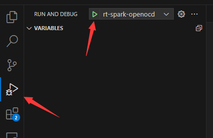

下载成功后会弹出这个，点击第二个全速运行，不出意外可以看到LED在闪烁
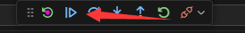

按照教程配置好环境后，尝试来点一下星火一号上的LED矩阵
## Menuconfig配置
首先进入RTThread源码目录下的stm32f407-rt-spark文件夹，右键空白区域打开ENV，输入
scons --target=vsc然后回车生成VSCode工程，已经生成过了继续往下

接着输入menuconfig.exe，然后回车进入配置界面

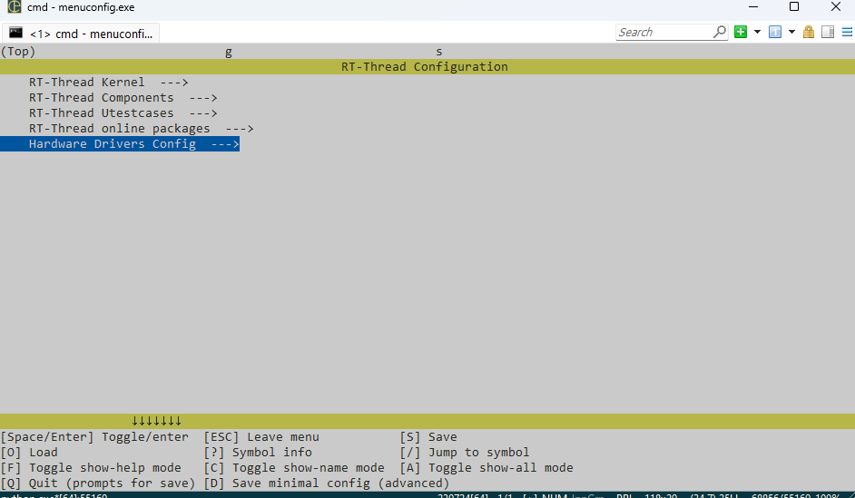

使用键盘的上下键来移动,回车进入,根据下图给的路径来到板子的外设配置界面

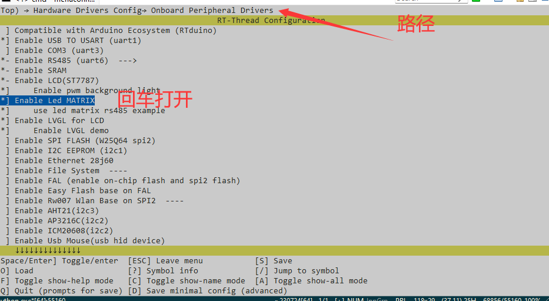
只需要来到Led MATRIX下按下回车打开即可，前面的 * 就是打开了的意思
配置好按ESC返回，中途提示要保存就按Y

## VSCode代码部分

在ENV输入code .进入vscode

打开main.c
加入如下代码

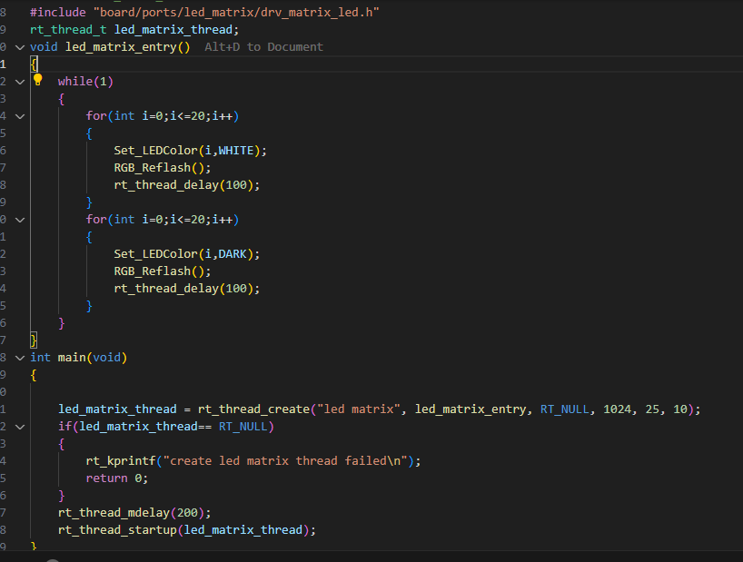
```

#include <board.h>

#include <rtthread.h>

#include <drv_gpio.h>

#ifndef RT_USING_NANO

#include <rtdevice.h>

#endif /* RT_USING_NANO */

#include "board/ports/led_matrix/drv_matrix_led.h"

rt_thread_t led_matrix_thread;

void led_matrix_entry()

{

    while(1)

    {

        for(int i=0;i<=20;i++)

        {

            Set_LEDColor(i,WHITE);

            RGB_Reflash();

            rt_thread_delay(100);

        }

        for(int i=0;i<=20;i++)

        {

            Set_LEDColor(i,DARK);

            RGB_Reflash();

            rt_thread_delay(100);

        }

    }

}

int main(void)

{
    led_matrix_thread = rt_thread_create("led matrix", led_matrix_entry, RT_NULL, 1024, 25, 10);

    if(led_matrix_thread== RT_NULL)

    {

        rt_kprintf("create led matrix thread failed\n");

        return 0;

    }

    rt_thread_mdelay(200);

    rt_thread_startup(led_matrix_thread);

}

```
代码比较简陋

接下来编译
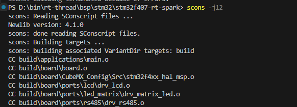

没有问题那就可以运行了
点开全速运行应该就能看到Led矩阵的效果了
